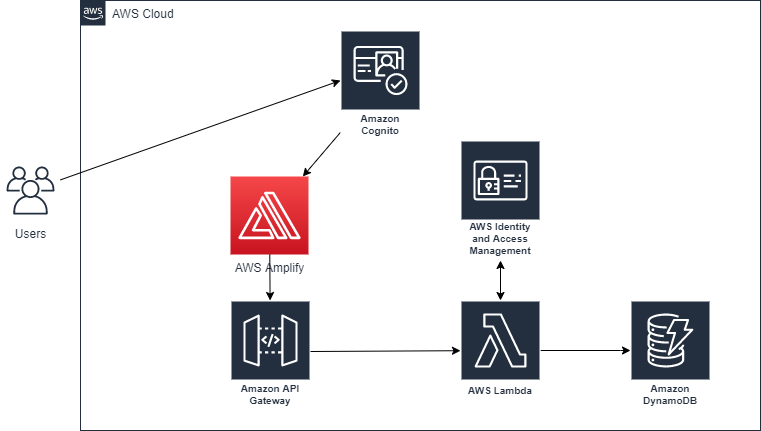

# Deploying a dynamic serverless web application on AWS

This project involves deploying a dynamic web application on Amazon Web Services (AWS) using a variety of services including AWS Amplify, Amazon API Gateway, AWS Lambda, Amazon DynamoDB,AWS Cognito and AWS Identity and Access Management (IAM). The application architecture is designed to leverage these services to create a scalable and efficient system.

# Application architecture

### This project is divided into six short modules. You must complete each module in order before moving on to the next one.

-- Create Web App : Deploy static resources for your web application using the AWS Amplify Console.
-- Build Serverless Function : Build a serverless function using AWS Lambda.
-- Link Serverless Function to Web App : Deploy your serverless function with API Gateway.
-- Create Data Table : Persist data in an Amazon DynamoDB table.
-- Add Interactivity to Web App : Modify your web app to invoke your API.
-- AWS Cognito

### Project Modules

### Create Web App - Deploy static resources for your web application using the AWS Amplify Console.

1. **Create Web App**: Utilize the AWS Amplify Console to deploy the dynamic resources for the web application.

### Build Serverless Function - Build a serverless function using AWS Lambda.

2. **Build Serverless Function**: Develop serverless functions using AWS Lambda, enabling interaction with the database and data storage without server management overhead. JavaScript is the primary language used for function development.

   #### Key Concepts:

   - Compute Service: AWS Lambda provides computational processing power without the need for server management.
   - Serverless Function: Executes code on-demand without idle time.
   - Lambda Trigger: Events that initiate Lambda function execution.

### Link Serverless Function to Web App - Deploy your serverless function with API Gateway.

3. **Link Serverless Function to Web App**: Deploy serverless functions with API Gateway to enable RESTful API creation. API Gateway acts as an intermediary between the web client and the serverless backend.

   #### Accomplishments:

   - Creation of API using API Gateway.
   - Definition of HTTP methods on the API.
   - Lambda function invocation from the API.
   - Cross-Origin Resource Sharing (CORS) implementation.
   - Testing of the API via AWS Management Console.

   #### Key Concepts:

   - RESTful API: Implements the REST architectural pattern.
   - HTTP Request Methods: Enable communication between clients and servers.
   - CORS: Facilitates resource access across different origins.

### Create Data Table - Persist data in an Amazon DynamoDB table.

4. **Create Data Table**: Establish a DynamoDB table to persist data, utilizing its key-value database service features for schema-less data storage. IAM is employed to manage permissions, granting Lambda functions the necessary access to write data to the DynamoDB table via the AWS SDK (JavaScript).

   #### Accomplishments:

   - DynamoDB table creation via AWS Management Console.
   - Role creation and permission management with IAM.
   - Writing to the DynamoDB table using AWS SDK (JavaScript).
   - We will create a table to persist data using Amazon DynamoDB. DynamoDB is a key-value database service, so we do not need to create a schema for our data. It has consistent performance at any scale and there are no servers to manage when using it.
   - Additionally, we will use the AWS Identity and Access Management (IAM) service to securely give our services the required permissions to interact with each other. Specifically, we are going to allow the Lambda function we created in step two to write to our newly created DynamoDB table using an IAM policy. To do this, we will use the AWS SDK (JavaScript) from our Lambda function.

### Test the Web App - Interact with the web app to invoke your API.

5. **Test the Web App**: Validate the web application's functionality by invoking the API, allowing interaction between the web client and the Lambda function to manipulate data stored in DynamoDB.

### AWS Cognito - Integrate with the web app

6. **AWS Cognito Integration**: Incorporate AWS Cognito to simplify authentication and authorization mechanisms for accessing the web application.

   #### Accomplishments:

   - Creation of a user pool.
   - Configuration of user attributes.
   - App client setup.
   - Domain URL configuration.

## Security Analysis:

Now, let's analyze the security aspects of the AWS services used in your project:

### AWS Amplify:

- **Authentication and Authorization**: AWS Amplify provides authentication and authorization capabilities through integration with AWS Cognito. This enables secure access control to the deployed web application.
- **Secure Hosting**: AWS Amplify Console ensures secure hosting of static web resources, utilizing HTTPS by default to encrypt data in transit. It also provides features like continuous deployment and rollback capabilities, ensuring the integrity of the deployed application.

### Amazon API Gateway:

- **Authentication and Authorization**: API Gateway supports various authentication mechanisms including AWS IAM, Amazon Cognito, and custom authorizers. This allows for secure access control to the exposed APIs, ensuring that only authorized users can invoke the API endpoints.

- **Request Validation**: API Gateway enables request validation, allowing validation of incoming requests against defined schemas. This helps prevent common security vulnerabilities such as injection attacks by validating input data.

### AWS Lambda:

- **Execution Environment Isolation**: AWS Lambda provides execution environments that are isolated from each other, ensuring that code execution is sandboxed and secure. Each Lambda function runs in its own container, ensuring that resources are isolated from other functions.

- **IAM Role-Based Access Control**: Lambda functions can be associated with IAM roles, allowing granular permissions to be defined for accessing AWS resources. This ensures that functions have the least privilege necessary to perform their tasks, enhancing security.

### Amazon DynamoDB:

- **Encryption at Rest**: DynamoDB supports encryption at rest, ensuring that data stored in the database is encrypted using industry-standard encryption algorithms. This protects sensitive data from unauthorized access in the event of a data breach.

- **Fine-Grained Access Control**: IAM policies can be used to control access to DynamoDB tables, allowing granular permissions to be defined for different users and roles. This ensures that only authorized users can read from or write to the database.

### AWS Cognito:

- **Authentication and Authorization**: AWS Cognito provides robust authentication and authorization mechanisms, supporting multi-factor authentication (MFA) and user attribute verification. It also offers customizable password policies and account recovery options, enhancing security.

- **User Pools**: Cognito User Pools allow for the creation of user directories, enabling centralized management of user identities and access control. This ensures that only authenticated users with valid credentials can access the web application.

### AWS Identity and Access Management (IAM):

- **Role-Based Access Control**: IAM allows for the creation of roles with granular permissions, enabling fine-grained access control to AWS resources. This ensures that only authorized entities can access specific resources, reducing the attack surface and enhancing security.

- **Credential Management**: IAM provides features for managing access keys, passwords, and permissions, ensuring secure credential management practices. This helps prevent unauthorized access to AWS resources and protects against credential theft.

Summary, the combination of AWS services used in this project provides a robust security framework, encompassing authentication, authorization, encryption, access control, and secure hosting. By leveraging these services and implementing best practices, you can ensure that your dynamic serverless web application is secure and resilient against potential security threats.

## Cost Analysis:

Let's analyze the cost considerations for the AWS services used in this project:

### AWS Amplify:

- **Cost Model**: AWS Amplify Console offers a pay-as-you-go pricing model, where you only pay for the resources you consume, such as build minutes and hosting bandwidth. No cost up to 500,000 requests per month and the charge per minute is $0.01 per minute.

- **Cost Components**: The primary cost components include build minutes for continuous deployment, hosting bandwidth for serving web content, and any additional features utilized, such as analytics or monitoring.

### Amazon API Gateway:

- **Cost Model**: API Gateway offers a consumption-based pricing model, where you pay for the number of API calls made and the amount of data transferred. Charge for First 300 million is $1.00.

- **Cost Components**: The main cost components include API requests, data transfer (inbound and outbound), and any additional features used, such as request validation or caching.

### AWS Lambda:

- **Cost Model**: AWS Lambda follows a pay-as-you-go pricing model, where you're charged based on the number of requests and the duration of execution. First 6 Billion GB-seconds / month is $0.20 per 1M requests

- **Cost Components**: The primary cost components include the number of invocations (requests) and the execution time (duration) of Lambda functions. There may also be additional costs for data transfer and storage if applicable.

### Amazon DynamoDB:

- **Cost Model**: DynamoDB offers a pay-per-request pricing model, where you're charged based on the number of read and write requests, along with any provisioned throughput capacity.

- **Cost Components**: The main cost components include read and write requests, provisioned throughput capacity (if applicable), and storage costs based on the amount of data stored in DynamoDB tables.

### AWS Cognito:

- **Cost Model**: AWS Cognito pricing is based on the number of monthly active users (MAUs) and the volume of data stored in user pools. 50,001-100,000 (after the 50,000 free tier) is $0.0055

- **Cost Components**: The primary cost components include monthly active users (MAUs), data storage for user attributes, and any additional features used, such as multi-factor authentication (MFA) or custom workflows.

### AWS Identity and Access Management (IAM):

- **Cost Model**: IAM is included as part of the AWS Free Tier and does not incur additional charges. However, there may be costs associated with using IAM features in conjunction with other AWS services.

- **Cost Components**: There are no direct costs associated with IAM itself, but you may incur charges for using IAM features in combination with other AWS services, such as API Gateway or Lambda.

### Overall Cost Considerations:

- **Initial Two Months**: Calculate the projected costs for the initial two months based on expected usage patterns, including API calls, Lambda invocations, DynamoDB read/write requests, and user activity in Cognito user pools.

- **Future Scalability**: Estimate potential future costs with increased API usage, Lambda function invocations, and DynamoDB data storage as the application scales and user traffic grows.

- **Cost Optimization**: Implement cost optimization strategies such as using AWS Free Tier credits, optimizing Lambda function performance, and monitoring usage metrics to identify areas for optimization and cost reduction.

By considering these cost factors and implementing cost optimization strategies, you can effectively manage the expenses associated with deploying and operating your dynamic serverless web application on AWS.
